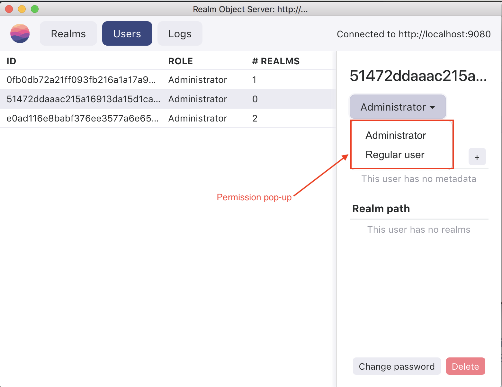

# RChat - A Realm Platform Demo 
### Authors: Max Alexander, max.elexander@realm.io & David Spector, ds@realm.io

#Overview

# Data Model

## Prerequisites

 - Xcode 8.33 or higher
 - Realm Object Server 2.0.11 or higher
 - Cocoapods
 - Nodejs v8.6 or higher
 - Node Package Manager (npm)

The RChat iOS  app uses [Cocoapods](https://www.cocoapods.org) to set up the project's 3rd party dependencies. Installation can be directly (from instructions at the Cocapods site) or alternatively through a package management system like [Homebrew](brew.sh/).

### Realm Platform

This application demonstrates features of the [Realm Platform](https://realm.io/products/realm-platform/) and needs to have a working instance of the Realm Object Server version 2.x to make data available between instances of the CrowdCircle app. The Realm Object Server can be installed via npm as a node application for macOS or Linux. Please see the [installation instructions](https://realm.io/docs/get-started/installation/developer-edition/). If you already got Node.js installed, it's a one-liner.

### Realm Studio

Another useful tool is [Realm Studio](https://realm.io/products/realm-studio/) which is available for macOS, Linux and Windows and allows developers to inspect and manage Realms and the Realm Object Server. Realm Studio is recommended for all developers and can be downloaded from the [Realm web site](https://realm.io/products/realm-studio/).

### 3rd Party Modules

RChat makes use of a number of 3rd party modules:

[Chatto]()
[ChattoAdditions]()
[RealmSwift]()
[SideMenu]()
[SDWebImage]()
[Eureka]()
[Cartography]()
[TURecipientBar]()
[NVActivityIndicatorView]()
[BRYXBanner]()
[RealmLoginKit]()

# Installation

1. clone this repository `git clone https://github.com/realm/roc-ios` to your  machine

## Preparing the ROS Server

This application comes with a demo server tagainst which you can run the RChat client.  The ROS platform requires NodeJS version 8.5 or higher and the npm node package manager installed in order to be able to run. If these are already installed, continue with the instructions below, if you need further info on nodejs or NPM installaton

0. Open a new temrinal window
0. Change directory to the download location where you downloaded the RChat repository
0. Change directory to the `RChatMinimalServer` directory
0. Install the required node server modules by running `npm install`
0. Run the node server with the command `node .` in the same same director

### Initial User Setup

Since this is _client focued demo_, there is not a back-end server that sets up the RChat Realm or its permissions.  In order to ensure the Realm permissions are correctly set the first user that logs in using the RChat service needs to be a Realm Server Administrator user.

To accomplish this, launch Realm Studio and create one user that will be "user #1" for RChat  and grant that user Server Administrator permission. This is done by creating a new user or editing an existing user and then setting the administrator permission in the User Panel as shown here:

 

## Preparing the iOS Client
2. Change directory to the `ROC-IOS` directory
3. Run `pod update` 
4. Open the workspace `open RChat.xcworkspace` with Xcode

### Pointing to the Correct Server

By default this client points to the local machine as its ROS server. if you have set up a ROS server on a different machine, you will need to edit the server IP address in the file `RChatConstants.swift` (which is in the `RChat/Data` directory)  and replace the IP address for the Realm Server address with you server IP.

5. Run the app by selecting a simulator from Xcode's menu, and the press Build & Run; the simulator will start and you can log in to the chat server using the username and passowrd created above using Realm Studio.

 ## Contributing

See [CONTRIBUTING.md](CONTRIBUTING.md) for more details!

This project adheres to the [Contributor Covenant Code of Conduct](https://realm.io/conduct/). By participating, you are expected to uphold this code. Please report unacceptable behavior to [info@realm.io](mailto:info@realm.io).

## License

Distributed under the Apache 2.0 license. See [LICENSE](LICENSE) for more information.

